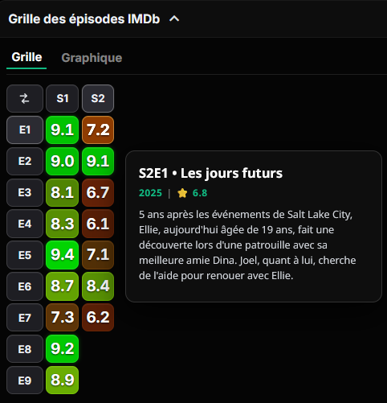
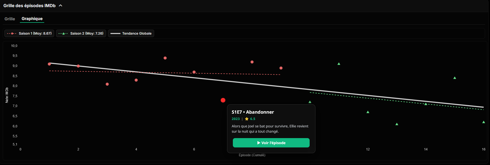

# IMDb Heatmap & Chart Jellyfin Plugin

A plugin for Jellyfin that adds an interactive episode ratings heatmap and cumulative rating trend chart to TV series pages.

The Heatmap design is based on [Damocles-fr/jellyfin-imdb-episodes-heatmap-ratings-grid](https://github.com/Damocles-fr/jellyfin-imdb-episodes-heatmap-ratings-grid).

## 📈 Features

This plugin adds a new tab to the series detail page which displays a heatmap of episode ratings and a chart of cumulative rating trend.

When hovering over an episode, a tooltip is displayed with the episode title, summary and rating.





The plugin is available in english and french. [Feel free to propose a PR for your language !](https://github.com/tholeb/jellyfin-imbd-heatmap-and-chart/tree/2f1e9c875518e885d9e6fa9b312107abf8852738/Jellyfin.Plugin.ImdbHeatmap/Localization)


## 📦 Installation & Plugin Updates

To install and receive automatic updates directly inside Jellyfin:

1. Open **Jellyfin Dashboard** → **Plugins** → **Repositories**.
2. Click **+ Add Repository**.
3. Set **Repository Name**: `IMDb Heatmap & Chart`
4. Set **Repository URL**:
   ```
   https://raw.githubusercontent.com/tholeb/jellyfin-imbd-heatmap-and-chart/master/manifest.json
   ```
5. Save, then go to **Catalog** to install the plugin.

## 🔧 Building from source

```bash
dotnet build
```

## 💡 Inspiration & Thanks

- [Damocles-fr/jellyfin-imdb-episodes-heatmap-ratings-grid](https://github.com/Damocles-fr/jellyfin-imdb-episodes-heatmap-ratings-grid)
- [ya0903/imdb-episode-dataset](https://github.com/ya0903/imdb-episode-dataset)

---

## AI Usage

This project is completly vibecoded.
